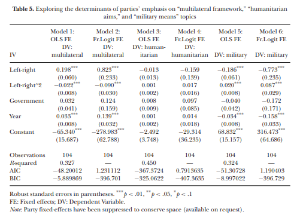

# Background

In @curini:2021:CMU, the following regression table was reported (@fig-regression).

{#fig-regression}

Specifically, for model 2, the regression coefficient for Left-Right is **0.823**. In our multiverse analysis, however, this positive coefficient was not returned. We adopted the following R code shared on Harvard Dataverse: [https://dataverse.harvard.edu/file.xhtml?fileId=4291432&version=1.0](https://dataverse.harvard.edu/file.xhtml?fileId=4291432&version=1.0). The code, in verbatim, is following:

```r
rm(list=ls(all=TRUE))
# setwd("....") set your working directory where the legislative speech texts are stored

# to fully replicate our results you need to have installed the following two packages: #<1>
# "quanteda.seededlda_0.2" and "quanteda_1.5.1" #<1>

# to install "quanteda.seededlda_0.2":
# devtools::install_github("koheiw/seededlda", ref = "ad0c345a6f05d3cfefd15f3f108a03d7653791b2")

# to install "quanteda_1.5.1":
# devtools::install_github("quanteda/quanteda", ref = "v1.5.1") 

# If you are using a quanteda version >2.0, and you want to avoid to install quanteda_1.5.1. (highly recommended),
# to replicate our results you can also simply load the "dfm.RData" Workspace.
# In this case, after having loaded such Workspace, you can avoid Step 1 and 2, and start the analysis directly since Step 3 below

require(quanteda)
require(readtext)
require(quanteda.seededlda)

####################################################
#### Step 1: open the texts
# IMPORTANT: the "zip_texts" archive file in Dataverse is a .rar file. Before running this script, please transform it from a .rar file to
# a .zip file. For example from here: https://www.convertfiles.com/convert/archive/RAR-to-ZIP.html
####################################################

myText <- readtext("zip_texts.zip", #<2>
docvarsfrom = "filenames", dvsep = "_", docvarnames = c("Party", "Mission"), encoding = "UTF-8") #<2>
names(myText)[1] <- "Name"
myText$Name <- gsub(".txt", "", myText$Name )

####################################################
#### Step 2: clean texts, creating corpus and then DfM
####################################################

myText$text <- gsub("[\u0092]","'",myText$text)
myText$text <- gsub("[\u2019]","'",myText$text)
myText$text <- gsub("[\u00b4]","'",myText$text)
myText$text <- gsub("[\u00d5]","'",myText$text)
myText$text <- gsub("[\u017e]","'",myText$text)
myText$text <- gsub("[\u017d]","'",myText$text)
myText$text <- gsub("[\u02c6]","'",myText$text)
myText$text <- gsub("[\u00ca]","'",myText$text)
myText$text <- gsub("[\u02dc]","'",myText$text)
myText$text <- gsub("[\u00c7]","'",myText$text)
myText$text <- gsub("'"," ",myText$text)

myText$text <- gsub("�no�","no",myText$text)
myText$text <-  gsub("�no�","no",myText$text)
myText$text <-  gsub("�No�","no",myText$text)

meta.pr <- read.csv("meta_table.csv", 1)
meta.pr$Name <- as.character(meta.pr$Name )
meta.pr <- meta.pr[,-2]
names(meta.pr)[4] <- "Mission_name"

fit <- merge(myText, meta.pr, by = "Name")
names(fit)[5] <- "LR"
fit <- fit[,-1]
fit$Party <- as.factor(fit$Party)
fit$Mission <-as.factor(fit$Mission )

corpus <- corpus(fit) # <3>
docnames(corpus) <- meta.pr$Name # <3>

myDfm <- dfm(corpus, remove = c(stopwords("italian"), "l", "d", "dell", "dall", "afganistan", "libano", "kosovo", "iraq", "libia", "albania")
, tolower = TRUE, stem = TRUE, remove_punct = TRUE, remove_numbers=TRUE) # <3>

########################### 
### Step 3: define the word-seeds
########################### 

myDict <- dictionary(list(multilateralism= c("multilateralism", "comunit", "responsabilit", "alleanza", "alleati", "impegno", 
"sicurezza", "coalizione"), #<4>
   humanitarian_dimension= c("democrazia", "umani", "democrazia", "democratica", "diritto", "pace", "solidariet", "libert", "pacific*", 
"umanitaria", "umanitari", "solidal*"),
   war= c("guerra", "militare", "bombardamenti", "militari", "costituzione", "disarmo", "chiarezza", "violenza", "bombe", "rischi", 
"vittime"))) 

##########################
### Step 4: fitting the seeded LDA 
########################## 

set.seed(123) #<5>
slda <- textmodel_seededlda(myDfm, myDict, residual = TRUE)

# let's extract the coefficients for each topic across documents
multilateralism<- rep(NA, nrow(myText))
for (i in 1:104){
multilateralism[i] <- slda$lda@gamma[i,][1]
}

humanitarian_dimension <- rep(NA,  nrow(myText))
for (i in 1:104){
humanitarian_dimension [i] <- slda$lda@gamma[i,][2]
}

war <- rep(NA,  nrow(myText))
for (i in 1:104){
war  [i] <- slda$lda@gamma[i,][3]
}

fit_slda  <-fit[-c(1)]
fit_slda $multilateralism <- multilateralism
fit_slda $humanitarian_dimension<- humanitarian_dimension
fit_slda $war<- war

##########################
### Step 5: saving the results for the Stata analysis
########################## 

write.csv(fit_slda, "scores_slda.csv") #<6>
```

1. The authors specifically asks for `quanteda` 1.5.1 and `quanteda.seededlda` 0.2.
2. The data shared on Dataverse is an RAR file.
3. The corpus `corpus` is created. The document-term matrix (or `dfm`) `myDfm` is also created. Please note that there are some additional words such as "afganistan", "libano", "kosovo", "iraq", "libia", "albania" are considered stopwords.
4. The dictionary is defined. Please note that some words are not the same as reported in the paper (e.g., "multilateralism" vs "multilateralismo" in the paper).
5. The random seed is hardcoded to 123.
6. The output is saved as `scores_slda.csv` for further analysis in Stata.

Please note also that the work space dump was also shared:  [https://dataverse.harvard.edu/file.xhtml?fileId=4291438&version=1.0](https://dataverse.harvard.edu/file.xhtml?fileId=4291438&version=1.0). In the dump, among other things, `corpus` and `myDfm` are included. In addition, the generated file `scores_slda.csv` was also shared.

We were asked to investigate what causes the discrepancy (the reported positive value in @curini:2021:CMU and the negative values in our multiverse analysis). Indeed, we adopted the code but also introduced several changes.

1. We did not use Stata for the regression analysis.
2. We did not run the code using the same R packages. Specifically, we used more recent `quanteda` and `seededlda` (the successor package of `quanteda.seededlda` by the same author); and also a more recent version of R.
3. We used an Italian stemmer.

# Plan

In this investigation, we construct a Docker image using the following Dockerfile that should represent a similar, if not the same, computational environment as what @curini:2021:CMU was used for their analysis. 

```Dockerfile

```

With this Docker image, we launch a Docker container (Except Step 5) to run the original code and data shared by @curini:2021:CMU on Dataverse. We modify one thing at a time, until we find out the discrepancy in the estimate. We can then establish a causal link between what has been changed and the irreproducibility of the originally reported estimate by @curini:2021:CMU, i.e. a positive estimate of **0.823**.

# Step 1: Testing our translated R code for regression

In the original analysis, the fractional regression analysis was conducted with Stata using the following code.

```stata
reg multi100 c.lr##c.lr gov year i.code, r
```

In the main analysis, we translated this Stata code to R. In the most basic analysis, we used the data shared by @curini:2021:CMU (`scores_slda.csv`, which contains the precalculated results from seeded LDA) to conduct the same analysis using our R code. This tests that our translated R code for conducting fractional regression analysis does not cause the regression coefficient of LR turning negative.

```{r filename="part1.R"}
#| eval: false

```

```{bash}
docker compose run --remove-orphans --rm r36 Rscript --vanilla "meta/curinidocker/part1.R"
```

Indeed, the regression coefficient of LR is still positive and exactly the same.

# Step 2: Testing the original seedlda code

As the regression code is not the reason for irreproducibility, it should be because of the text analysis step. As the original workspace dump was provided, we rerun here the analysis from the provided document-term matrix.

```{r filename="part2.R"}
#| eval: false

```

```{bash}
docker compose run --remove-orphans --rm r36 Rscript --vanilla "meta/curinidocker/part2.R"
```

Still, the regression coefficient of LR is still positive and exactly the same.

# Step 3: Testing the original tokenization code

The original workspace dump contains also the corpus `corpus`. This step is almost the same as Step 2, only the original code for creating the document-term matrix is added.

```{r filename="part3.R"}
#| eval: false

```

1. The only line of code added compared to `part2.R`.

```{bash}
docker compose run --remove-orphans --rm r36 Rscript --vanilla "meta/curinidocker/part3.R"
```

What we observe here is that the regression coefficient of LR is now negative. We also observe that the original code for creating the document-term matrix cannot reproduce the same document-term matrix in the workspace dump. Some terms that should not be included are there in the document-term matrix inside the workspace dump (e.g., "www.verdi.it", it should be tokenized into "www", "verdi", "it"). 

It cannot be explained by the option of stemmer language setting. We attempted also to change this to Italian.

```{r filename="part3ita.R"}
#| eval: false

```

1. The only line of code added compared to `part3.R`. This line of code for setting an option could be in the initialization file (e.g., `.Rprofile`).

```{bash}
#| code-fold: true
#| code-summary: "Show the results"
docker compose run --remove-orphans --rm r36 Rscript --vanilla "meta/curinidocker/part3ita.R"
```

In fact, we observed more missing terms using the Italian stemmer. Based on the Italian stemming algorithm, many Italian terms of the original document-term matrix in the workspace dump were not properly tokenized. For instance, "penso" (English: I think) should be tokenized to "pens". But it was tokenized into "penso" in the original document-term matrix. 

It is almost certain that the original authors would have used the default English stemmer to stem Italian texts. It can also be reflected in the terms in the dictionary for seeded LDA: Terms in the dictionary were assumed to be stemmed using the English stemmer. In addition, we also observed many terms in the original document-term matrix with incorrect encoding (e.g., "grazie<U+00E8>"). It *could* be due to the fact that the original authors did the tokenization on a machine that was not configured properly to handle Unicode (UTF-8).

Nonetheless, the regression coefficient of LR is positive now but not the same.

## Additional investigations

A possible explanation would be the underlying R package for tokenization, `SnowballC`, is not the same. The original authors did not provide any information on that (e.g. `sessionInfo()`). We did some investigation of the source code of `SnowballC`. It was updated in January 2019 to 0.6.0. But that update did not touch on any code related to [English or Italian tokenization](https://github.com/cran/SnowballC/commit/b583c1ff5cabdfa75a2af58f823d2d042f4e9b81#diff-662c9d9731e7aa4c416a820087ce9cdf5e733c1ec2a9d7eaa121a2b67a5954de). Therefore, using 0.5.1 (which was released in August 2014) or 0.6.0 should not influence the tokenization.

Similarly, using the CRAN version of `quanteda` 1.5.1 or the Github version of 1.5.1 (which the original authors recommended) does not affect the tokenization.

## Summary of this step

The original code, even without introducing anything new, cannot reproduce the original finding, not least because of tokenization. We cannot (fully) explain the reason for irreproducibility of the original code. [^1] But one thing is clear: The regression coefficient changes drastically just by tweaking how one tokenizes or normalizes the texts using the original code. This part matches the findings of the multiverse analysis. Also, the original finding of a positive regression coefficient might well be an artefact of machine-specific idiosyncrasies, including how a (misconfigurated) computational environment handles Unicode. 

[^1]: We do not have any evidence of foul play.

# Step 4: Testing stochastic stability

Taking the last reproducible code (Step 2), we test the stochastic stability by making the fixed random seed a parameter.

```{r filename="part4.R"}
#| eval: false

```

1. We make the random seed a parameter. 

We run the following with three different random seeds, which are selected similar to what we did in the multiverse analysis:

```{r}
set.seed(123)
sample(-65535:65535, 3)
```

```{bash}
docker compose run --remove-orphans --rm r36 Rscript --vanilla "meta/curinidocker/part4.R" -13973
```

```{bash}
docker compose run --remove-orphans --rm r36 Rscript --vanilla "meta/curinidocker/part4.R" -7666
```

```{bash}
docker compose run --remove-orphans --rm r36 Rscript --vanilla "meta/curinidocker/part4.R" -62550
```

From the three runs, we obtained very negative estimates (as negative as -0.99) only by switching to other random seeds. Therefore, the original positive estimate is not stochastically robust. This part matches the findings of the multiverse analysis.

# Step 5: Step 2 but on a modern computational environment

Please note that the following is not run under a Docker container (Note the `sessionInfo()`).

```{r}
suppressPackageStartupMessages(library(here))
suppressPackageStartupMessages(library(sandwich))
suppressPackageStartupMessages(library(lmtest))
suppressPackageStartupMessages(library(quanteda))
suppressPackageStartupMessages(library(seededlda))

load(here("rawdata/dfm.RData"))

## convert the pre quanteda 2 dfm to a modern data structure
myDfm <- as.dfm(myDfm)

cat("Dimenions\n")
print(dim(myDfm))

myDict <- dictionary(list(
    multilateralism = c(
        "multilateralism",
        "comunit",
        "responsabilit",
        "alleanza",
        "alleati",
        "impegno",
        "sicurezza",
        "coalizione"
    ),
    humanitarian_dimension = c(
        "democrazia",
        "umani",
        "democrazia",
        "democratica",
        "diritto",
        "pace",
        "solidariet",
        "libert",
        "pacific*",
        "umanitaria",
        "umanitari",
        "solidal*"
    ),
    war = c(
        "guerra",
        "militare",
        "bombardamenti",
        "militari",
        "costituzione",
        "disarmo",
        "chiarezza",
        "violenza",
        "bombe",
        "rischi",
        "vittime"
    )
))

set.seed(123)

slda <- textmodel_seededlda(
    x = myDfm,
    dictionary = myDict,
    residual = 1,
    verbose = FALSE
)

fit_slda <- fit[-c(1)]
fit_slda$multilateralism <- slda$theta[,"multilateralism"]
fit_slda$humanitarian_dimension <- slda$theta[,"humanitarian_dimension"]
fit_slda$war <- slda$theta[,"war"]

reg_data <- fit_slda

reg_data$multi100 <- reg_data$multilateralism /
    (reg_data$multilateralism + reg_data$humanitarian_dimension + reg_data$war)

glmmod <- glm(
    multi100 ~ LR + I(LR^2) + Gov + Year + as.factor(Party),
    data = reg_data,
    family = quasibinomial("logit")
)
print(coeftest(glmmod, vcov. = vcovHC(glmmod, type = "HC0")))
print(sessionInfo())
```

Using a modern version of `seededlda`, even with the same document-term matrix and the same random seed, one cannot obtain exactly the same estimate.

# Step 6 (Partial): Seed words Dictionary

In the main multiverse analysis, we modified the seed words with the wild card character. We attempted to run Step 2 but with the seed words corrected. However, it is not possible due to software issue (the underlying R package for handling topic modeling `topicmodels` cannot correctly allocate memory when the number of keywords is high).

Here, we can only run this on a modern computational environment similar to Step 5.

```{r}
suppressPackageStartupMessages(library(here))
suppressPackageStartupMessages(library(sandwich))
suppressPackageStartupMessages(library(lmtest))
suppressPackageStartupMessages(library(quanteda))
suppressPackageStartupMessages(library(seededlda))

load(here("rawdata/dfm.RData"))

## convert the pre quanteda 2 dfm to a modern data structure
myDfm <- as.dfm(myDfm)

cat("Dimenions\n")
print(dim(myDfm))

myDict <- dictionary(list( # <1>
    multilateralism = c(
        "multilateral*",
        "comun*",
        "respons*",
        "alleanz*",
        "alle*",
        "impegn*",
        "sicurezz*",
        "coalizion*"
    ),
    humanitarian_dimension = c(
        "democraz*",
        "democrat*",
        "uman*",
        "diritt*",
        "pac*",
        "solidariet*",
        "libert*",
        "pacif*",
        "umanitar*",
        "solidal*"
    ),
    war = c(
        "guerr*",
        "milit*",
        "bombard*",
        "militar*",
        "costitu*",
        "disarm*",
        "chiarezz*",
        "violenz*",
        "bomb*",
        "risc*",
        "vittim*"
    )
))

set.seed(123)

slda <- textmodel_seededlda(
    x = myDfm,
    dictionary = myDict,
    residual = 1,
    verbose = FALSE
)

fit_slda <- fit[-c(1)]
fit_slda$multilateralism <- slda$theta[,"multilateralism"]
fit_slda$humanitarian_dimension <- slda$theta[,"humanitarian_dimension"]
fit_slda$war <- slda$theta[,"war"]

reg_data <- fit_slda

reg_data$multi100 <- reg_data$multilateralism /
    (reg_data$multilateralism + reg_data$humanitarian_dimension + reg_data$war)

glmmod <- glm(
    multi100 ~ LR + I(LR^2) + Gov + Year + as.factor(Party),
    data = reg_data,
    family = quasibinomial("logit")
)
print(coeftest(glmmod, vcov. = vcovHC(glmmod, type = "HC0")))
print(sessionInfo())
```

1. The dictionary is corrected with the wildcard character (asterisk).

# Summary

The original estimate is not reproducible because of the following factors: (1) how the documents are tokenized, (2) stochastic instability, and (3) changes in software; even the data and code is largely the same.
